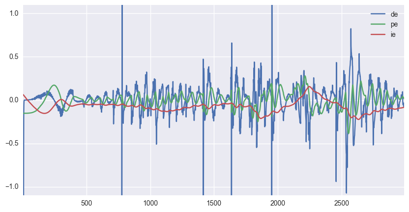
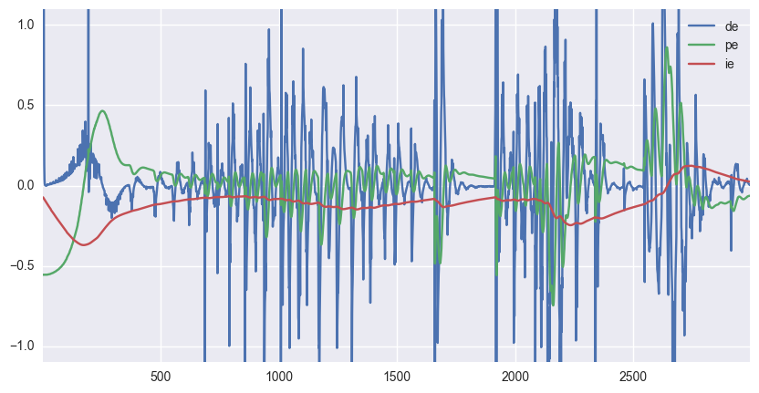
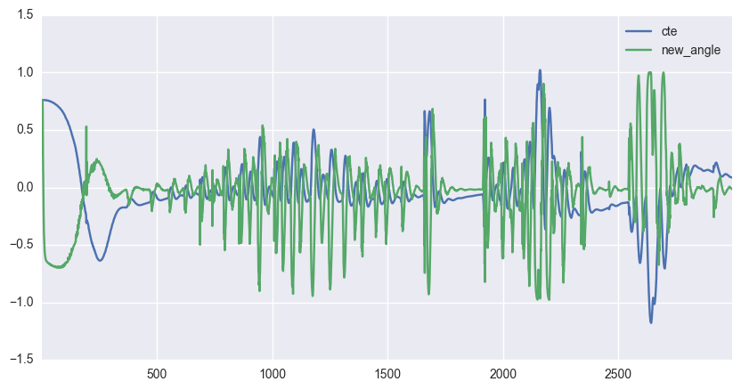

# PID controller for a car

## Running it

Start the simulator and run the program with no arguments to use my parameters or pass the following parameters: p, i, d, max_running_time, max_cte_before_fail

## Tuning Process

The PID controller has three gains that can be adjusted to get good performance. The p or proportional gain controls how much of a response should be applied in direct proportion to the cross track error. The i or integral gain is used to offset long running errors such as those caused by a bias. It is applied to the integral of the cross track error. Finally, the d gain is the amount to adjust by the derivative of the CTE. It is used to dampen oscillations caused by p gain.

The tuning process went as follows: First I zeroed out all the gains and incrementally increased the p gain first so that the car would stay on the track and then eventually until the oscillations became so violent it would leave the track even on a straight segment. I then increased the d gain to dampen these oscillations. Finally I adjusted the I gain. There was lots of back and forth though, it was not this straightforward.

After this rough tuning manual tuning, the python script auto_tune.ipynb was run to automatically adjust the values using the twiddle optimization method.

p = [p gain, i gain, d gain]

before tuning (baseline): p=[.2,.1,.1], x axis is roughly time

after tuning: p=[0.7308569492165553, 0.1338155374232569, 0.3593786299378923]

The metric for the twiddle method was the RMS CTE for a duration of 3000 control updates (or less if the CTE were to ever go over 3.0, I interpreted this as "off the track"). The algorithm increased the p gain to a much higher value than I had found by hand and relying on strong d gain to keep the car from overshooting. 

CTE and steering angle (tuned)

video of the tuned system
<video controls="controls" width="auto" height="480" name="tuned" src="img/sample_drive.mov"></video>

## Dependencies

* cmake >= 3.5
 * All OSes: [click here for installation instructions](https://cmake.org/install/)
* make >= 4.1
  * Linux: make is installed by default on most Linux distros
  * Mac: [install Xcode command line tools to get make](https://developer.apple.com/xcode/features/)
  * Windows: [Click here for installation instructions](http://gnuwin32.sourceforge.net/packages/make.htm)
* gcc/g++ >= 5.4
  * Linux: gcc / g++ is installed by default on most Linux distros
  * Mac: same deal as make - [install Xcode command line tools]((https://developer.apple.com/xcode/features/)
  * Windows: recommend using [MinGW](http://www.mingw.org/)
* [uWebSockets](https://github.com/uWebSockets/uWebSockets) == 0.13, but the master branch will probably work just fine
  * Follow the instructions in the [uWebSockets README](https://github.com/uWebSockets/uWebSockets/blob/master/README.md) to get setup for your platform. You can download the zip of the appropriate version from the [releases page](https://github.com/uWebSockets/uWebSockets/releases). Here's a link to the [v0.13 zip](https://github.com/uWebSockets/uWebSockets/archive/v0.13.0.zip).
  * If you run OSX and have homebrew installed you can just run the ./install-mac.sh script to install this
* Simulator. You can download these from the [project intro page](https://github.com/udacity/CarND-PID-Control-Project/releases) in the classroom.

## Basic Build Instructions

1. Clone this repo.
2. Make a build directory: `mkdir build && cd build`
3. Compile: `cmake .. && make`
4. Run it: `./pid`. 